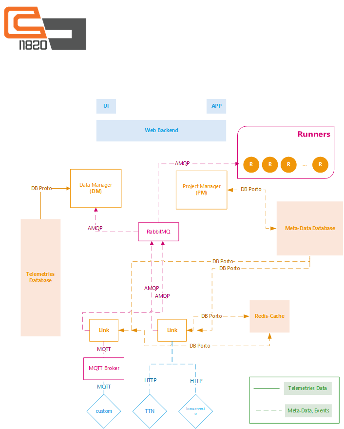

# I1820 Homepage

## Introduction
I1820 Platform Homepage from good old days in Aolab until now.

## Awesome Lists
- [HQarroum/awesome-iot](https://github.com/HQarroum/awesome-iot)

## Brand Style
Colors:
- [#F36F21 Vivid orange](https://www.colorhexa.com/f36f21)
- [#555555 Very dark gray](https://www.colorhexa.com/555555)

Fonts:
- [Butterbelly-Regular](branding/fonts/Butterbelly-Regular.ttf)
- [Agency-FB-Regular](branding/fonts/AGENCYR.TTF)
- [Agency-FB-Bold](branding/fonts/AGENCYB.TTF)

## Architecture
I1820 platform architecture can be seen in the following figure. For more detailed information, please see our website
or contanct me with my [email](mailto:parham.alvani@gmail.com).

